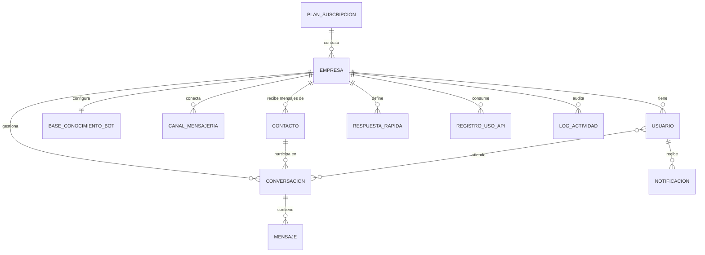

# 📊 Smart AI Hosting Solutions — Modelos de Base de Datos

> **Versión:** 1.0  
> **Fecha:** 2026-08-05  
> **Motor:** MySQL 8.0+ | Arquitectura Multi-Tenant (DB Única)

---

## 🔵 1. MODELO CONCEPTUAL (Alto Nivel)

El modelo conceptual muestra **QUÉ entidades existen** y **CÓMO se relacionan** entre sí,
sin entrar en detalles técnicos. Es el que presentas al cliente o al equipo de negocio.

### Diagrama Conceptual



### Descripción de Entidades (Lenguaje de Negocio)

| Entidad | ¿Qué representa? | Ejemplo Real |
|---------|-------------------|--------------|
| **Plan de Suscripción** | Los paquetes comerciales que vendes | "Plan Básico $29.99/mes", "Plan Avanzado $79.99/mes" |
| **Empresa (Tenant)** | Cada cliente B2B que contrata tu servicio | "Clínica Dental Sonrisa", "Restaurante El Buen Sabor" |
| **Usuario** | Personas que acceden al Dashboard o la Bandeja | El dueño de la clínica, la recepcionista, tú como SuperAdmin |
| **Base de Conocimiento** | Lo que el bot sabe para responder | Horarios, precios, preguntas frecuentes del negocio |
| **Canal de Mensajería** | Conexión configurada con WhatsApp/Messenger/IG | "WhatsApp de la Clínica: +51 999 888 777" |
| **Contacto (Lead)** | Persona que escribe por WhatsApp/Messenger/IG | "María García — +51 987 654 321" |
| **Conversación** | Hilo de chat entre un contacto y la empresa | "Chat #1542 — María pregunta por precios" |
| **Mensaje** | Cada texto/imagen/audio enviado o recibido | "Hola, ¿cuál es su horario?" → "Atendemos de 9am a 6pm" |
| **Respuesta Rápida** | Plantillas de texto para responder al instante | "/saludo" → "¡Hola! Gracias por contactarnos..." |
| **Registro de Uso API** | Control de consumo de la IA | "Gemini: 150 tokens usados, costo $0.0023" |
| **Log de Actividad** | Registro de quién hizo qué en el sistema | "Admin pausó el bot el 15/01 a las 3pm" |
| **Notificación** | Alertas internas del sistema | "⚠️ Tu cuota mensual está al 80%" |

### Relaciones en Lenguaje Natural

1. Una **Empresa** contrata exactamente un **Plan de Suscripción**.
2. Una **Empresa** tiene muchos **Usuarios** (dueño + agentes).
3. Una **Empresa** configura exactamente una **Base de Conocimiento** para su bot.
4. Una **Empresa** puede conectar varios **Canales** (WhatsApp, Messenger, Instagram).
5. Una **Empresa** recibe mensajes de muchos **Contactos** (leads).
6. Un **Contacto** puede tener varias **Conversaciones** (hilos de chat).
7. Cada **Conversación** contiene muchos **Mensajes**.
8. Un **Usuario** (agente) puede atender varias **Conversaciones** y ser asignado a ellas.

---

## 🟢 2. MODELO LÓGICO (Nivel Intermedio)

El modelo lógico muestra **las entidades con sus atributos principales, tipos de datos
y relaciones con cardinalidad**. No incluye índices ni detalles físicos del motor.

### Diagrama Lógico

```mermaid
erDiagram
    subscription_plans {
        bigint id PK
        varchar name
        varchar slug UK
        text description
        decimal price
        varchar currency
        enum billing_cycle "monthly | yearly"
        smallint max_agents
        tinyint max_channels
        int message_limit_per_month
        enum ai_engine_allowed "local | gemini | both"
        json features
        boolean is_active
        timestamp created_at
        timestamp updated_at
    }

    tenants {
        bigint id PK
        bigint subscription_plan_id FK
        varchar company_name
        varchar slug UK
        varchar legal_name
        varchar tax_id
        varchar contact_email
        varchar phone
        varchar country
        varchar timezone
        enum status "trial | active | suspended | cancelled"
        timestamp trial_ends_at
        timestamp subscription_starts_at
        timestamp subscription_ends_at
        int current_month_message_count
        varchar api_token UK
        json settings
        timestamp deleted_at
    }

    users {
        bigint id PK
        bigint tenant_id FK "NULL para SuperAdmin"
        varchar name
        varchar email UK
        varchar password
        enum role "super_admin | tenant_owner | tenant_agent"
        boolean is_active
        boolean is_online
        timestamp last_login_at
        timestamp deleted_at
    }

    chatbot_knowledges {
        bigint id PK
        bigint tenant_id FK_UK "UNIQUE = Relacion 1:1"
        varchar bot_name
        text system_prompt
        json business_hours
        json catalog
        json faqs
        text welcome_message
        text out_of_hours_message
        boolean is_bot_active
        decimal ai_temperature
        tinyint max_context_messages
    }

    tenant_channels {
        bigint id PK
        bigint tenant_id FK
        enum channel "whatsapp | messenger | instagram"
        varchar phone_number_id
        varchar page_id
        varchar instagram_account_id
        text access_token "ENCRIPTADO"
        boolean is_active
        boolean is_verified
    }

    contacts {
        bigint id PK
        bigint tenant_id FK
        varchar name
        varchar phone_number
        varchar messenger_id
        varchar instagram_id
        varchar email
        json metadata
        boolean is_blocked
        timestamp last_interaction_at
    }

    conversations {
        bigint id PK
        bigint tenant_id FK
        bigint contact_id FK
        bigint assigned_user_id FK "NULL = sin asignar"
        enum channel "whatsapp | messenger | instagram"
        enum status "open | bot_active | human_active | waiting | resolved | closed"
        enum priority "low | normal | high | urgent"
        boolean is_bot_paused
        timestamp last_message_at
        int message_count
        timestamp resolved_at
    }

    messages {
        bigint id PK
        bigint tenant_id FK
        bigint conversation_id FK
        bigint contact_id FK
        bigint user_id FK "NULL = respondio bot"
        enum channel "whatsapp | messenger | instagram"
        enum direction "inbound | outbound"
        enum message_type "text | image | audio | video | document"
        text content
        varchar media_url
        boolean is_ai_generated
        enum ai_engine_used "local | gemini"
        int ai_tokens_used
        enum status "queued | sent | delivered | read | failed"
        varchar external_message_id
    }

    canned_responses {
        bigint id PK
        bigint tenant_id FK
        varchar title
        varchar shortcut
        text content
        varchar category
        boolean is_active
        int usage_count
    }

    api_usage_logs {
        bigint id PK
        bigint tenant_id FK
        enum service "gemini | local_ai | whatsapp | messenger | instagram"
        int tokens_input
        int tokens_output
        int tokens_total
        decimal estimated_cost
        int response_time_ms
        boolean is_successful
        timestamp created_at
    }

    activity_logs {
        bigint id PK
        bigint tenant_id FK "NULL para acciones globales"
        bigint user_id FK "NULL si fue el sistema"
        varchar action
        varchar entity_type
        bigint entity_id
        json old_values
        json new_values
        varchar ip_address
        timestamp created_at
    }

    notifications {
        char id PK "UUID"
        varchar type
        varchar notifiable_type
        bigint notifiable_id
        json data
        timestamp read_at
    }

    subscription_plans ||--o{ tenants : "1:N"
    tenants ||--o{ users : "1:N"
    tenants ||--|| chatbot_knowledges : "1:1"
    tenants ||--o{ tenant_channels : "1:N"
    tenants ||--o{ contacts : "1:N"
    tenants ||--o{ conversations : "1:N"
    tenants ||--o{ messages : "1:N"
    tenants ||--o{ canned_responses : "1:N"
    tenants ||--o{ api_usage_logs : "1:N"
    tenants ||--o{ activity_logs : "1:N"
    contacts ||--o{ conversations : "1:N"
    conversations ||--o{ messages : "1:N"
    users ||--o{ conversations : "atiende"
    contacts ||--o{ messages : "1:N"
    users ||--o{ messages : "responde"
    users ||--o{ activity_logs : "genera"
```

### Cardinalidad de las Relaciones

| Relación | Cardinalidad | Significado |
|----------|-------------|-------------|
| `subscription_plans` → `tenants` | **1:N** | Un plan tiene muchas empresas; una empresa tiene un solo plan |
| `tenants` → `users` | **1:N** | Una empresa tiene muchos usuarios; un usuario pertenece a una empresa |
| `tenants` → `chatbot_knowledges` | **1:1** | Una empresa tiene exactamente una base de conocimiento |
| `tenants` → `tenant_channels` | **1:N** | Una empresa puede tener varios canales configurados |
| `tenants` → `contacts` | **1:N** | Una empresa recibe mensajes de muchos contactos |
| `tenants` → `conversations` | **1:N** | Una empresa tiene muchas conversaciones |
| `contacts` → `conversations` | **1:N** | Un contacto puede tener varias conversaciones |
| `conversations` → `messages` | **1:N** | Una conversación contiene muchos mensajes |
| `users` → `conversations` | **1:N** | Un agente puede estar asignado a varias conversaciones |
| `users` → `messages` | **1:N** | Un agente puede enviar muchos mensajes (nullable) |
| `tenants` → `canned_responses` | **1:N** | Una empresa define muchas respuestas rápidas |
| `tenants` → `api_usage_logs` | **1:N** | Una empresa tiene muchos registros de uso |
| `tenants` → `activity_logs` | **1:N** | Una empresa tiene muchos logs de actividad |

---

## 🔴 3. MODELO FÍSICO (Nivel Técnico)

El modelo físico incluye **todos los detalles de implementación**: tipos de datos exactos,
tamaños, índices, claves foráneas con acciones ON DELETE/UPDATE, constraints, y
configuración del motor de almacenamiento.

> ⚠️ **El modelo físico completo está en el archivo `database_schema.sql`.**
> Aquí presentamos el resumen técnico.

### Resumen de Tablas y Optimizaciones

| Tabla | Motor | Filas Est. | Índices | FKs | Optimización |
|-------|-------|-----------|---------|-----|-------------|
| `subscription_plans` | InnoDB | < 10 | 2 | 0 | Tabla pequeña, caché en memoria |
| `tenants` | InnoDB | < 10,000 | 7 | 1 | Soft delete, índice en `status` |
| `users` | InnoDB | < 50,000 | 6 | 1 | Soft delete, índice compuesto `(tenant_id, role)` |
| `chatbot_knowledges` | InnoDB | < 10,000 | 1 UK | 1 | UNIQUE en `tenant_id` (1:1) |
| `tenant_channels` | InnoDB | < 30,000 | 5 | 1 | Índice en `phone_number_id` para lookup del webhook |
| `contacts` | InnoDB | < 1,000,000 | 6 | 1 | Índices compuestos por `tenant_id` |
| `conversations` | InnoDB | < 5,000,000 | 6 | 5 | Índice DESC en `last_message_at` para bandeja |
| `messages` | InnoDB | **< 50,000,000** | **8** | 4 | ⚠️ **Big Data.** Índice compuesto para métricas IA. Particionar en futuro |
| `canned_responses` | InnoDB | < 50,000 | 2 | 2 | Índice en `shortcut` para búsqueda rápida |
| `api_usage_logs` | InnoDB | < 10,000,000 | 3 | 1 | Solo INSERT (append-only). No tiene `updated_at` |
| `activity_logs` | InnoDB | < 10,000,000 | 5 | 2 | Solo INSERT. Índice DESC en `created_at` |
| `notifications` | InnoDB | < 500,000 | 2 | 0 | UUID como PK (sistema de Laravel) |

### Claves Foráneas con Acciones

| FK | Tabla Padre | Tabla Hija | ON DELETE | ON UPDATE | Justificación |
|----|-------------|------------|-----------|-----------|--------------|
| `subscription_plan_id` | `subscription_plans` | `tenants` | **RESTRICT** | CASCADE | No se puede borrar un plan si tiene empresas |
| `tenant_id` | `tenants` | `users` | **CASCADE** | CASCADE | Si se borra la empresa, se borran sus usuarios |
| `tenant_id` | `tenants` | `chatbot_knowledges` | **CASCADE** | CASCADE | Si se borra la empresa, se borra su config de bot |
| `tenant_id` | `tenants` | `contacts` | **CASCADE** | CASCADE | Si se borra la empresa, se borran sus contactos |
| `tenant_id` | `tenants` | `conversations` | **CASCADE** | CASCADE | Si se borra la empresa, se borran sus conversaciones |
| `tenant_id` | `tenants` | `messages` | **CASCADE** | CASCADE | Si se borra la empresa, se borran sus mensajes |
| `tenant_id` | `tenants` | `tenant_channels` | **CASCADE** | CASCADE | Si se borra la empresa, se borran sus canales |
| `tenant_id` | `tenants` | `canned_responses` | **CASCADE** | CASCADE | Si se borra la empresa, se borran sus respuestas |
| `tenant_id` | `tenants` | `api_usage_logs` | **CASCADE** | CASCADE | Si se borra la empresa, se borran sus logs |
| `tenant_id` | `tenants` | `activity_logs` | **SET NULL** | CASCADE | Los logs se conservan como auditoría general |
| `contact_id` | `contacts` | `conversations` | **CASCADE** | CASCADE | Si se borra el contacto, se borran sus conversaciones |
| `contact_id` | `contacts` | `messages` | **CASCADE** | CASCADE | Si se borra el contacto, se borran sus mensajes |
| `conversation_id` | `conversations` | `messages` | **CASCADE** | CASCADE | Si se borra la conversación, se borran sus mensajes |
| `assigned_user_id` | `users` | `conversations` | **SET NULL** | CASCADE | Si se borra el agente, la conversación queda sin asignar |
| `user_id` | `users` | `messages` | **SET NULL** | CASCADE | Si se borra el agente, el mensaje se conserva |
| `user_id` | `users` | `activity_logs` | **SET NULL** | CASCADE | Los logs se conservan sin referencia al usuario |

### Índices Estratégicos (Los más importantes)

```
-- MENSAJES: Índice compuesto para la bandeja multiagente
idx_messages_conversation (conversation_id, created_at ASC)
→ Usado cada vez que un agente abre una conversación para leer el historial

-- MENSAJES: Índice para métricas ROI
idx_messages_ai_metrics (tenant_id, is_ai_generated, created_at)
→ Usado para calcular: "¿Cuántos mensajes resolvió la IA este mes?"

-- CONVERSACIONES: Índice para ordenar la bandeja
idx_conversations_last_message (tenant_id, last_message_at DESC)
→ Usado para mostrar las conversaciones más recientes primero

-- CONTACTOS: Índice compuesto para lookup del webhook
idx_contacts_phone (tenant_id, phone_number)
→ Usado cada vez que llega un mensaje: "¿Existe este número para este tenant?"

-- TENANT CHANNELS: Índice para identificar el tenant
idx_tenant_channels_phone (phone_number_id)
→ Usado en el webhook: "¿A qué tenant pertenece este Phone Number ID?"

-- API USAGE: Índice para el interruptor de presupuesto
idx_api_usage_tenant_service (tenant_id, service, created_at)
→ Usado para calcular consumo mensual por tenant y servicio
```

---

## 🛠️ 4. HERRAMIENTAS PARA VISUALIZAR LOS MODELOS

### Opción 1: MySQL Workbench (RECOMENDADA — Gratuita)

La herramienta oficial de MySQL. Genera diagramas ERD profesionales automáticamente.

**Pasos:**
1. Descargar: https://dev.mysql.com/downloads/workbench/
2. Abrir MySQL Workbench → **File > New Model**
3. Menú **File > Import > Forward Engineer SQL Script...**
4. Seleccionar el archivo `docs/database_schema.sql`
5. Ir a la pestaña **EER Diagram** → ¡Diagrama físico generado automáticamente!
6. Puedes arrastrar las tablas, cambiar colores, y exportar como PNG/PDF

**Alternativa (Reverse Engineer desde BD existente):**
1. Crear la BD en tu MySQL local ejecutando el script
2. En MySQL Workbench: **Database > Reverse Engineer...**
3. Seleccionar la base de datos → Genera el diagrama ERD completo

---

### Opción 2: dbdiagram.io (Gratuita — Online, sin instalación)

Herramienta web que genera diagramas desde un lenguaje simple llamado DBML.

**Pasos:**
1. Ir a https://dbdiagram.io
2. Pegar el código DBML del archivo `docs/database_dbml.dbml` (generado abajo)
3. El diagrama se genera automáticamente
4. Exportar como PNG, PDF o incluso generar SQL desde ahí

---

### Opción 3: phpMyAdmin (Ya incluida en cPanel)

Si ya tienes la base de datos creada en tu servidor:
1. Entrar a phpMyAdmin desde cPanel
2. Seleccionar la base de datos
3. Click en la pestaña **"Diseñador"** (Designer)
4. Muestra las tablas con sus relaciones de forma visual

---

### Opción 4: DBeaver (Gratuita — Alternativa a MySQL Workbench)

1. Descargar: https://dbeaver.io/download/
2. Conectar a tu base de datos MySQL
3. Click derecho en la BD → **View Diagram**
4. Genera un diagrama ERD interactivo

---

### Opción 5: draw.io / diagrams.net (Gratuita — Manual)

Para diagramas conceptuales personalizados:
1. Ir a https://app.diagrams.net
2. Usar las formas de "Entity Relation" del panel lateral
3. Crear el diagrama manualmente arrastrando entidades

---

## 📝 5. RESUMEN: ¿CUÁL MODELO PARA QUÉ?

| Modelo | ¿Para quién? | ¿Qué muestra? | ¿Herramienta? |
|--------|-------------|----------------|----------------|
| **Conceptual** | Cliente / Equipo de negocio | Entidades y relaciones en lenguaje natural | draw.io, Mermaid (este archivo) |
| **Lógico** | Arquitecto / Líder técnico | Atributos, tipos de datos, cardinalidad | dbdiagram.io, Mermaid (este archivo) |
| **Físico** | DBA / Desarrollador Senior | Índices, FKs, constraints, motor, particiones | MySQL Workbench, DBeaver |
